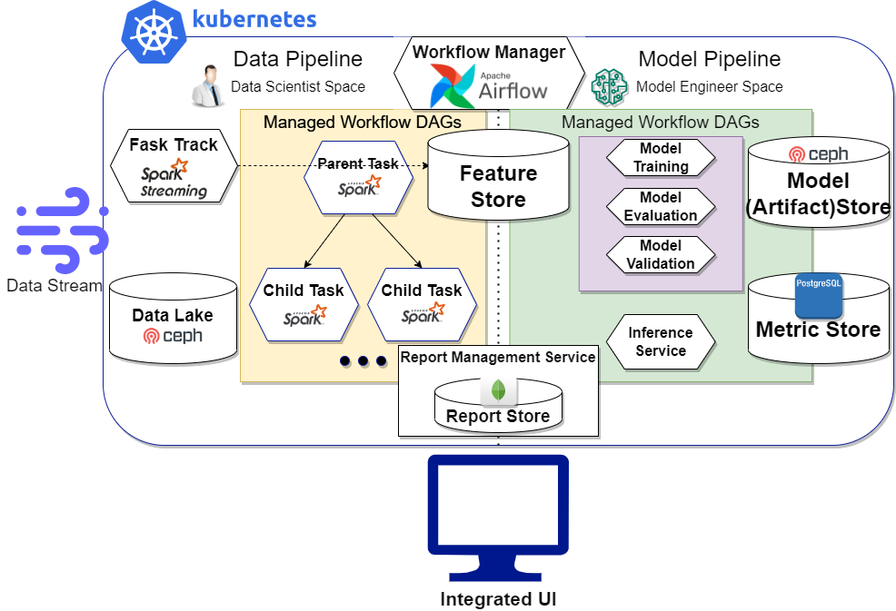

# Sparkhu

해당 리포지토리는 2022년 2학기 경희대학교 컴퓨터공학과 캡스톤디자인 2 수업
### 복합 시계열 데이터 분석 및 예측을 자동화하는 MLOps 시스템
프로젝트의 메인 리포지토리입니다.  
하위프로젝트는 다음과 같습니다.
<b>library</b>
- [aicns-feature-metadata-synchronizer](https://github.com/Youngmin-An/aicns-feature-metadata-synchronizer)
- [aicns-raw-data-loader](https://github.com/Youngmin-An/aicns-raw-data-loader.git)
- [aicns-univariate-analyzer](https://github.com/Youngmin-An/aicns-univariate-analyzer.git)
- 
<b>task</b>
- [aicns-data-cleaning-task](https://github.com/Youngmin-An/aicns-data-cleaning-task.git)
- [aicns-regularity-decision-making-task](https://github.com/Youngmin-An/aicns-regularity-decision-making-task.git)
- [aicns-feature-normalization-task](https://github.com/Youngmin-An/aicns-feature-normalization-task.git)
- [aicns-sliding-window-transformation-task](https://github.com/Youngmin-An/aicns-sliding-window-transformation-task.git)
- [aicns-data-validation-task](https://github.com/Youngmin-An/aicns-data-validation-task.git)
- [aicns-outlier-detection-iqr-task](https://github.com/Youngmin-An/aicns-outlier-detection-iqr-task.git)
- [aicns-missingvalue-detection-task](https://github.com/Youngmin-An/aicns-missingvalue-detection-task.git)
- [aicns-descriptive-analysis-task](https://github.com/Youngmin-An/aicns-descriptive-analysis-task.git)
- [aicns-regularity-analysis-task](https://github.com/Youngmin-An/aicns-regularity-analysis-task.git)
- [aicns-missingvalue-handling-task](https://github.com/Youngmin-An/aicns-missingvalue-handling-task.git)
- [aicns-handled-missingvalue-pooling-task](https://github.com/Youngmin-An/aicns-handled-missingvalue-pooling-task.git)
- [aicns-timeseries-decomposition-task](https://github.com/Youngmin-An/aicns-timeseries-decomposition-task.git)
- [aicns-anomaly-detection-residual-task](https://github.com/Youngmin-An/aicns-anomaly-detection-residual-task.git)
- [aicns-anomaly-handling-task](https://github.com/Youngmin-An/aicns-anomaly-handling-task.git)
- [aicns-auto-hyperparameter-tuning-task](https://github.com/Youngmin-An/aicns-auto-hyperparameter-tuning-task.git)
- [data_retention_management_service](https://github.com/Sparkhu/data-retention-management-service)
- [data_control_ui](https://github.com/Sparkhu/data-control-ui)

<b>infra</b>
- [aicns-workflow-manifest-sync](https://github.com/Youngmin-An/aicns-workflow-manifest-sync.git)
- 
## 1. 문제 정의
빅데이터 시대에 발빠른 데이터 처리 및 핵심 정보 도출 능력은 비즈니스 성패를 좌우합니다. 
다양한 (**V**ariety) 시각의 데이터를 가능한 많이 (**V**olume) 단시간 (**V**elocity) 내에 통합하고 처리하여, 정확한 (**V**eracity) 정보를 도출해내어 비즈니스에 가치 (**V**alue)를 더하는 작업은 <u>새로운 접근 방식</u>을 요구합니다.  
이러한 대형 시스템은 느슨한 상호의존성과 자동화된 운영능력을 갖추지 못하면 거대 데이터 폐기장에 불과합니다.

## 2. 프로젝트 소개
이 프로젝트는 여러 데이터 소스로부터 데이터를 쉽게 통합하고 관리하며, 
과거 시계열 데이터로부터 데이터 전처리, 분석을 자동화하고 분산학습을 지원하고 모델을 저장하는 MLOps 기반 자동화 솔루션 제공을 목표로 합니다.  
따라서 해당 프로젝트를 통해 운영자의 인프라 관리 및 소프트웨어 관리 개입을 줄이고 시계열 데이터의 장기적 특징 및 트렌드를 잘 반영한 예측 서비스를 제공받을 수 있습니다.  

전체적인 그림은 다음과 같습니다.

※ 본 연구는 과학기술정보통신부 및 정보통신기획평가원의 SW중심대학 사업의 연구결과로 수행되었음 (2017-0-00093) 지도교수: 허의남

## 3. 프로젝트 내용
### 3.1 시계열 데이터 전처리 및 분석 자동화

 각 시계열 데이터는 검증 및 정화 작업을 거쳐 성능에 악영향을 미치는 데이터를 배제하며, 모델 학습 및 추론에 활용될 수 있는 형태로 미리 변형되어 Feature Store에 저장된다. 정화된 데이터는 각각의 시계열 데이터에 대해 단변량 분석 및 복합 시계열 데이터 간 다변량 분석에 활용된다. 각 작업들은 여러 서브 태스크로 구성된다. 예를 들어 데이터 정화 작업은 중복제거, 결측치 처리, 이상치 검출 등의 서브 태스크로 구성될 수 있다. 각 작업들은 주로 매일 단위 배치 실행 방식으로 수행되며 작업들 간의 의존성은 Direct Acyclic Graph (DAG)로 구성되어 의존성이 있는 태스크 간에는 순차적으로 의존성이 없는 태스크 간에는 병렬로 수행될 수 있다. 각 작업에서 처리되어 변형된 데이터는 Data Warehouse에 저장되고 분석으로 산출된 Report는 문서 형태로 오프라인 분석 저장소에 저장된다. Feature Store는 모델 학습 및 추론에 사용될 데이터를 필요한 형태로 가공하여 저장하는 데이터 파이프라인과 모델 파이프라인의 경계 역할을 하며, 이를 통해 데이터 사이언티스트의 영역과 모델 엔지니어의 영역을 추상적으로 구분할 수 있다. 해당 작업들 간의 의존성 관리 및 배치 작업 트리거에 대한 명확한 솔루션은 워크플로우 관리자가 제공하며 대표적인 오픈 소스 워크플로우 관리 솔루션에는 Apache Airflow가 있다.

### 3.2 복합 데이터 융합
 다양한 데이터로부터 그 자체로 정보를 얻을 수 있지만 개별 데이터 소스로부터 추출할 수 있는 정보가 한정되어 있을 때, 여러 데이터의 상호 간 정보를 결합하면 활용할 수 있는 정보를 풍부하게 만들 수 있다[2]. 대표적인 시계열 데이터 상호 간에 추출될 수 있는 정보는 상관관계이다. 상관관계는 두 변수간 관계의 강도로 한 변수가 상승할 때 그에 따라 다른 변수도 상승하는지에 관한 정보를 제공한다[5]. 시계열 데이터는 주로 일정한 간격의 주기로 관측된 데이터인데 상대적으로 주기가 짧은 데이터는 덜 빈번하게 수집된 데이터보다 활용할 수 있는 정보가 더 많다. 이때 상관관계를 이용해서 주기가 짧은 데이터의 추세와 결합하면 주기가 긴 데이터를 증강하거나 예측 성능을 높이는데 활용할 수 있다. 다음 그림 2는 주기가 긴 데이터의 예측 성능을 향상시키기 위해 전제한 상황을 간략히 나타낸다. 시계열 데이터 B는 A에 비해 드물게 데이터가 관측되어서 활용할 수 있는 정보가 적음을 할 수 있다. 이때 상관관계가 높은 A로부터 A의 최근 추세가 급상승을 보였음을 활용하여 B 또한 상승할 것으로 예상하고 가중합을 주던가 하는 방식으로 B의 예측에 도움을 줄 수 있다.

### 3.3 데이터 보존 관리 서비스
앞서 언급한 것처럼 <u>데이터를 무한정 쌓으면 관리가 어려운 데이터 폐기장</u>이 되기 일쑤입니다.  
시스템이 가진 가용용량은 한계에 직면할 것이며 시스템 운영자가 겉잡을 수 없이 통합된 빅데이터는 수동으로 처리 불가한 수준에 도달하여 시스템 가용성을 제한합니다.  
이에 해당 프로젝트에서는 일반화된 데이터 보존 정책을 관리, 수행하는 서비스를 외부적으로 만들었습니다. [해당 리포지토리](https://github.com/Sparkhu/data-retention-management-service.git)를 참조하세요. 이제 자동화된 보존 관리 서비스에 의해 관리 지옥에서 벗어나고 일반화된 서비스로부터 자신의 스토리지 영역에 맞게 정책을 확장해 나갈 수 있습니다.

## 4. 프로젝트 결과
### 4.1 분산 학습에 따른 학습 시간 감소
클러스터 단위 작업에 따른 성능 비교는 다음과 같습니다.
 | **Node Setting** | Local |  Cluster |  Local  |  Cluster |  Local  |  Cluster |
| :--------: | :--------: | :------: | :-----: | :-----: | :-----: | :-----: |
| **Epochs**| 1| 1| 100 | 100 | 1000 | 1000|
| **Avg of job**| 38.8| 24.6| 361.1 | 156.9 | 4007.2 | 1370.3|

### 4.2 인프라 자동화의 필요성 감지
우리는 Spark, Yarn, Hadoop, Kubernetes 클러스터 구성 및 운영 단계에서 각 노드마다 같은 명령을 입력하거나 에러를 처리하는 지옥에 갇혔고 Ansible, Chef 등 IaC 도구와 CI/CD 연계의 필요성을 절실히 느꼈다. 또한 작업이 많아짐에 따라 클러스터 성능이 현저히 저하되는 것을 경험하여 모니터링 시스템부터 시작해서 자동 리소스 조정 영역까지 인프라 관리 자동화의 필요성을 느꼈다. 추후 이러한 부분을 개선해 나갈 예정이다.

## 5. Contributor
|이름 |소속|담당|참여기간|
|------|------|------|------|
|안영민|경희대학교 컴퓨터공학과|Product Owner & Infra Manager|2022-09-10~|

## 6. 라이센스
This project is licensed under the terms of the [**MIT license**](https://opensource.org/licenses/MIT) & [**APACHE LICENSE, VERSION 2.0**](https://www.apache.org/licenses/LICENSE-2.0.txt)..
